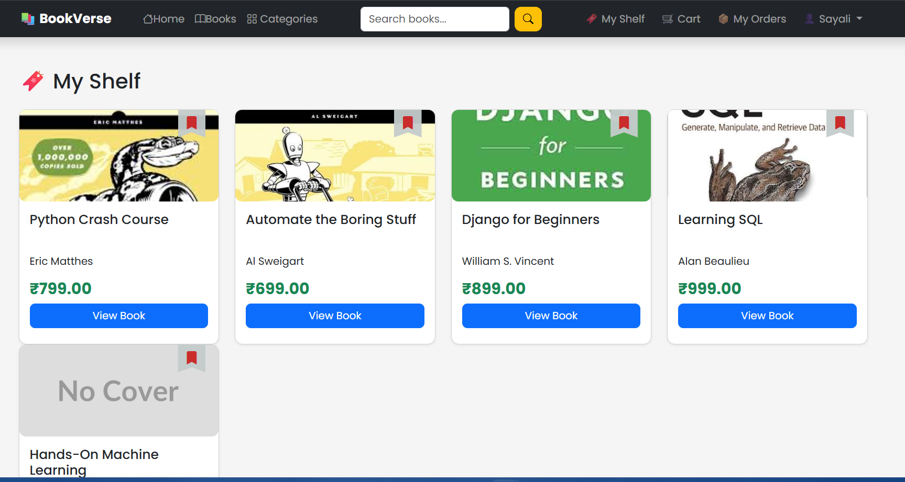
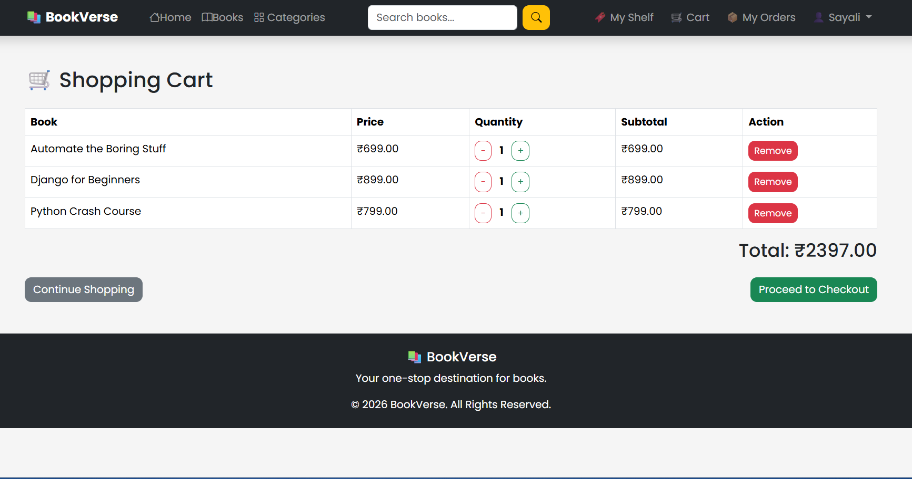
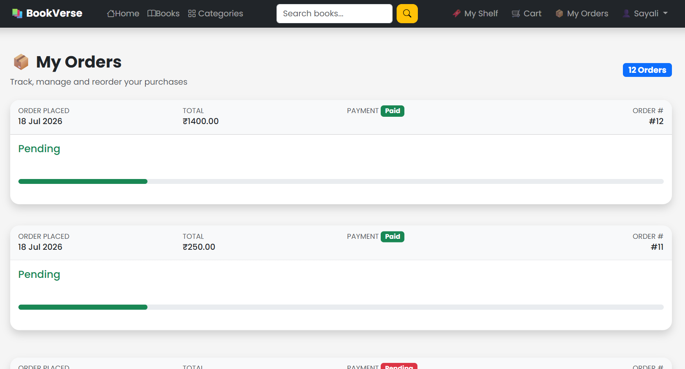

# 📚 Online Book Store

A modern full-stack **Online Book Store** built with **Django**, **MySQL**, and **Bootstrap**. The application allows users to browse books, manage their cart and wishlist, securely place orders using Razorpay, download invoices, and manage their purchases.

---

## 🚀 Features

### 👤 User Authentication
- User Registration
- Login & Logout
- Profile Management

### 📚 Book Management
- Browse Books
- Book Details
- Search Books
- Category Filtering
- Price Sorting
- Featured Books
- New Arrivals

### ❤️ Wishlist
- Add to Wishlist
- Remove from Wishlist
- Bookmark Toggle

### 🛒 Shopping Cart
- Add to Cart
- Update Quantity
- Remove Items
- Order Summary

### 💳 Secure Checkout
- Shipping Address
- Phone Number
- Razorpay Payment Gateway
- Payment Verification

### 📦 Order Management
- My Orders
- Order Status
- Cancel Order
- Buy Again
- Download PDF Invoice

### ⭐ Reviews & Ratings
- Book Ratings
- Customer Reviews
- Average Rating Display

### 🛠 Admin Panel
- Manage Books
- Manage Categories
- Manage Users
- Manage Orders
- Manage Reviews

---

# 🖥 Tech Stack

| Technology | Used |
|------------|------|
| Python | ✅ |
| Django | ✅ |
| MySQL | ✅ |
| HTML5 | ✅ |
| CSS3 | ✅ |
| Bootstrap 5 | ✅ |
| JavaScript | ✅ |
| Razorpay | ✅ |
| Git | ✅ |
| GitHub | ✅ |

---

# 📂 Project Structure

```
online_bookstore/
│
├── accounts/
├── books/
├── cart/
├── orders/
├── reviews/
├── wishlist/
├── dashboard/
├── templates/
├── static/
├── bookstore/
├── manage.py
└── requirements.txt
```

---

# 📸 Screenshots

> Add screenshots inside a folder named **screenshots**

Example:

```
screenshots/
│
├── home.png
├── books.png
├── details.png
├── wishlist.png
├── cart.png
├── checkout.png
├── payment.png
├── orders.png
├── invoice.png
└── admin.png
```

After adding screenshots:

## 🏠 Home Page


## 📚 Books


## ❤️ Wishlist



## 🛒 Cart



## 📦 Orders



---

# ⚙ Installation

## Clone Repository

```bash
git clone https://github.com/sayaliwagh-tech/online-bookstore-django.git
```

Go to project

```bash
cd online_bookstore
```

Create Virtual Environment

```bash
python -m venv .venv
```

Activate

Windows

```bash
.venv\Scripts\activate
```

Install Dependencies

```bash
pip install -r requirements.txt
```

Run Migrations

```bash
python manage.py migrate
```

Start Server

```bash
python manage.py runserver
```

Open

```
http://127.0.0.1:8000/
```

---

# 💳 Payment Gateway

Integrated with **Razorpay**

Features:

- Secure Payments
- Payment Verification
- Order Confirmation
- Payment Status

---

# 📦 Order Workflow

```
Browse Books
      ↓
Add to Cart
      ↓
Checkout
      ↓
Razorpay Payment
      ↓
Order Created
      ↓
Download Invoice
      ↓
Track Order
```

---

# 🎯 Future Enhancements

- Order Tracking
- Email Notifications
- Coupon System
- Recommendation System
- Dark Mode
- AI Book Recommendation
- Recently Viewed Books
- Best Sellers
  
---

# 📈 Learning Outcomes

This project helped in learning:

- Django Authentication
- ORM
- Models & Relationships
- CRUD Operations
- Bootstrap UI
- Payment Gateway Integration
- PDF Generation
- Git & GitHub
- MVC Architecture

---

# 👩‍💻 Author

**Sayali Wagh**

B.Tech CSE (AI & ML)

Python Developer | Django Developer | Data Analytics Enthusiast

GitHub:
https://github.com/sayaliwagh-tech

---

# ⭐ Support

If you like this project,

⭐ Star this repository

and feel free to contribute!

---

## 📜 License

This project is created for educational and portfolio purposes.
